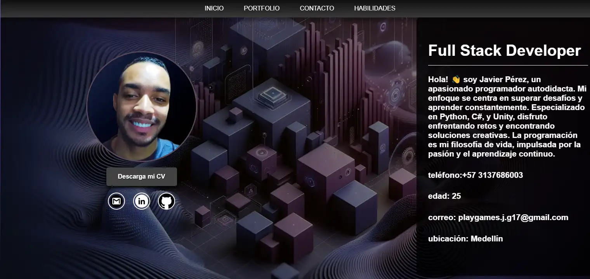
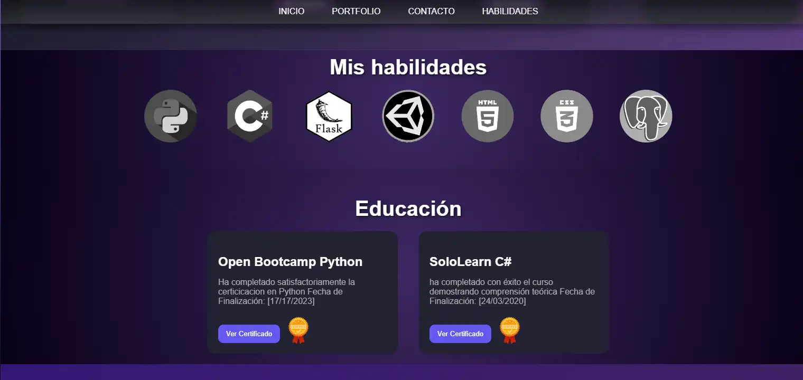
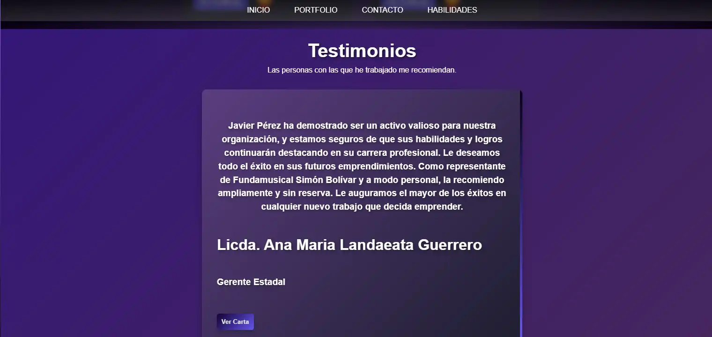

# ¡Bienvenido a mi Portfolio Web! 🚀

🌟Este es mi Portfolio Web personal, diseñado y desarrollado para mostrar mis habilidades como desarrollador de software. A través de este proyecto, quiero compartir mi pasión por la programación y destacar las contribuciones que he realizado en el mundo del desarrollo web.

## 💼 Características Principales
- **Diseño Moderno y Atractivo:** Mi portfolio cuenta con un diseño atractivo y moderno que refleja mi enfoque en la calidad y la estética en el desarrollo web.

- **Secciones Destacadas:** Explora las siguientes secciones clave de mi portfolio:
  - **Inicio:** Echa un vistazo a mi página de inicio, que presenta una selección de proyectos destacados y una breve introducción sobre mí.
  - **Habilidades:** Descubre mis habilidades técnicas y tecnologías en las que me especializo.
  - **Testimonios:** Lee lo que dicen mis clientes y colaboradores sobre mi trabajo y ética profesional.

- **Proyectos Destacados:** Explora una variedad de proyectos que he desarrollado, incluyendo sitios web, aplicaciones y más. Cada proyecto incluye detalles sobre su desarrollo y tecnologías utilizadas.

- **Tecnologías Utilizadas:** Este portfolio fue construido utilizando HTML, CSS y JavaScript, y es un ejemplo de mi experiencia en estas tecnologías.

## Capturas de Pantalla
A continuación, encontrarás capturas de pantalla de algunas secciones clave de mi portfolio:

### Sección de Inicio

### 📚 Sección de Habilidades

### Sección de Testimonios

¡Espero que disfrutes explorando mi portfolio y conozcas más sobre mi trabajo y pasión por la programación!

[Visita mi Portfolio](https://portfolio-eljega.vercel.app)

